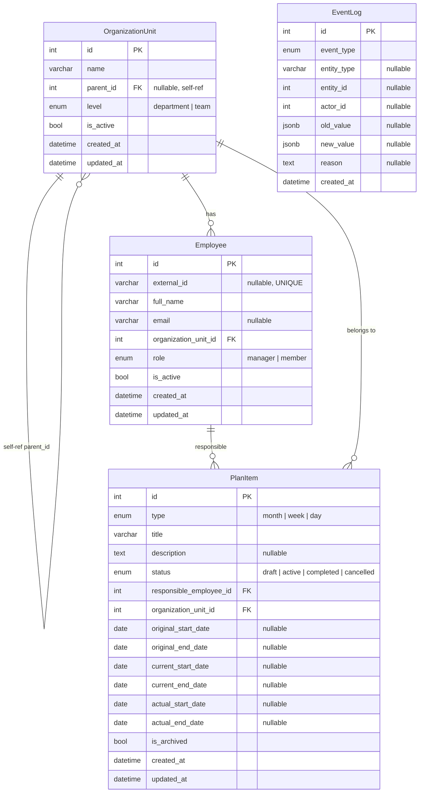

# Plan: Core Database Models Implementation (v2)

## 1. Обзор изменений

### Новые файлы (5):
| Файл | Назначение |
|------|-----------|
| `backend/app/models/enums.py` | Все enum'ы для моделей |
| `backend/app/models/organization_unit.py` | Модель OrganizationUnit |
| `backend/app/models/employee.py` | Модель Employee |
| `backend/app/models/plan_item.py` | Модель PlanItem (single-table) |
| `backend/app/models/event_log.py` | Модель EventLog (универсальный аудит) |

### Изменяемые файлы (2):
| Файл | Изменение |
|------|-----------|
| `backend/app/models/__init__.py` | Добавить импорты всех новых моделей |
| `backend/app/db/base.py` | Проверить — изменений не требуется |

### Автоматически создаваемые файлы (1):
| Файл | Назначение |
|------|-----------|
| `backend/alembic/versions/0002_create_core_models.py` | Миграция для новых таблиц |

---

## 2. Ключевые изменения (по фидбеку)

| № | Изменение | Было (v1) | Стало (v2) |
|---|-----------|-----------|------------|
| 1 | **EventLog универсальный** | `plan_item_id`, `employee_id` | `entity_type`, `entity_id`, `actor_id` |
| 2 | **PlanItem даты** | `planned_start_date`, `planned_end_date` | `original_start_date`, `original_end_date`, `current_start_date`, `current_end_date`, `actual_start_date`, `actual_end_date` |
| 3 | **created_at / updated_at** | Только у некоторых | У всех 4 таблиц |
| 4 | **Employee.external_id** | `NOT NULL`, `UNIQUE` | `nullable`, `UNIQUE` |
| 5 | **OrganizationUnit.level** | `String(20)` | `OrganizationLevel` enum |

---

## 3. Детальная спецификация каждого файла

### 3.1 `app/models/enums.py`

```python
import enum


class OrganizationLevel(str, enum.Enum):
    DEPARTMENT = "department"
    TEAM = "team"


class EmployeeRole(str, enum.Enum):
    MANAGER = "manager"
    MEMBER = "member"


class PlanItemType(str, enum.Enum):
    MONTH = "month"
    WEEK = "week"
    DAY = "day"


class PlanStatus(str, enum.Enum):
    DRAFT = "draft"
    ACTIVE = "active"
    COMPLETED = "completed"
    CANCELLED = "cancelled"


class EventType(str, enum.Enum):
    PLAN_CREATED = "plan_created"
    DEADLINE_CHANGED = "deadline_changed"
    STATUS_CHANGED = "status_changed"
    APPROVAL_REQUESTED = "approval_requested"
    APPROVAL_APPROVED = "approval_approved"
    APPROVAL_REJECTED = "approval_rejected"
    EXTERNAL_LINK_ADDED = "external_link_added"
    EXTERNAL_LINK_REMOVED = "external_link_removed"
    PLAN_ITEM_DELETED = "plan_item_deleted"
```

- 5 enum'ов
- Все `(str, enum.Enum)` — для PostgreSQL ENUM
- `ExternalSystemType` и `DeadlineChangeStatus` не создаём (будут во 2-м блоке)

---

### 3.2 `app/models/organization_unit.py`

```python
from datetime import datetime
from typing import TYPE_CHECKING

import sqlalchemy as sa
from sqlalchemy import Boolean, DateTime, ForeignKey, String, func
from sqlalchemy.orm import Mapped, mapped_column, relationship

from app.db.base import Base
from app.models.enums import OrganizationLevel

if TYPE_CHECKING:
    from app.models.employee import Employee


class OrganizationUnit(Base):
    __tablename__ = "organization_unit"

    id: Mapped[int] = mapped_column(primary_key=True, autoincrement=True)
    name: Mapped[str] = mapped_column(String(255), nullable=False)

    parent_id: Mapped[int | None] = mapped_column(
        ForeignKey("organization_unit.id", ondelete="SET NULL", onupdate="CASCADE"),
        nullable=True,
        index=True,
    )

    level: Mapped[OrganizationLevel] = mapped_column(
        sa.Enum(OrganizationLevel, name="organization_level"),
        nullable=False,
        index=True,
    )

    is_active: Mapped[bool] = mapped_column(
        Boolean, default=True, nullable=False,
    )

    created_at: Mapped[datetime] = mapped_column(
        DateTime, server_default=func.now(), nullable=False,
    )
    updated_at: Mapped[datetime] = mapped_column(
        DateTime, server_default=func.now(), onupdate=func.now(), nullable=False,
    )

    # Relationships
    parent: Mapped["OrganizationUnit | None"] = relationship(
        back_populates="children",
        remote_side="OrganizationUnit.id",
    )
    children: Mapped[list["OrganizationUnit"]] = relationship(
        back_populates="parent",
    )
    employees: Mapped[list["Employee"]] = relationship(
        back_populates="organization_unit",
    )

    __table_args__ = (
        sa.Index(
            "ix_organization_unit_is_active",
            "is_active",
            postgresql_where=sa.text("is_active = true"),
        ),
    )
```

**Индексы:**
- `parent_id` — B-tree (через `index=True`)
- `level` — B-tree (через `index=True`)
- `is_active` — partial B-tree WHERE is_active = true (через `__table_args__`)

---

### 3.3 `app/models/employee.py`

```python
from datetime import datetime
from typing import TYPE_CHECKING

import sqlalchemy as sa
from sqlalchemy import Boolean, DateTime, ForeignKey, String, func
from sqlalchemy.orm import Mapped, mapped_column, relationship

from app.db.base import Base
from app.models.enums import EmployeeRole

if TYPE_CHECKING:
    from app.models.organization_unit import OrganizationUnit
    from app.models.plan_item import PlanItem


class Employee(Base):
    __tablename__ = "employee"

    id: Mapped[int] = mapped_column(primary_key=True, autoincrement=True)

    external_id: Mapped[str | None] = mapped_column(
        String(255), unique=True, nullable=True,
    )

    full_name: Mapped[str] = mapped_column(String(255), nullable=False)

    email: Mapped[str | None] = mapped_column(
        String(255), nullable=True, index=True,
    )

    organization_unit_id: Mapped[int] = mapped_column(
        ForeignKey("organization_unit.id", ondelete="RESTRICT", onupdate="CASCADE"),
        nullable=False,
        index=True,
    )

    role: Mapped[EmployeeRole] = mapped_column(
        sa.Enum(EmployeeRole, name="employee_role"),
        default=EmployeeRole.MEMBER,
        nullable=False,
    )

    is_active: Mapped[bool] = mapped_column(
        Boolean, default=True, nullable=False,
    )

    created_at: Mapped[datetime] = mapped_column(
        DateTime, server_default=func.now(), nullable=False,
    )
    updated_at: Mapped[datetime] = mapped_column(
        DateTime, server_default=func.now(), onupdate=func.now(), nullable=False,
    )

    # Relationships
    organization_unit: Mapped["OrganizationUnit"] = relationship(
        back_populates="employees",
    )
    responsible_plans: Mapped[list["PlanItem"]] = relationship(
        back_populates="responsible_employee",
        foreign_keys="PlanItem.responsible_employee_id",
    )

    __table_args__ = (
        sa.Index(
            "ix_employee_is_active",
            "is_active",
            postgresql_where=sa.text("is_active = true"),
        ),
    )
```

**Индексы:**
- `external_id` — UNIQUE B-tree (через `unique=True`)
- `organization_unit_id` — B-tree (через `index=True`)
- `email` — B-tree (через `index=True`)
- `is_active` — partial B-tree WHERE is_active = true (через `__table_args__`)

---

### 3.4 `app/models/plan_item.py`

```python
from datetime import date, datetime
from typing import TYPE_CHECKING

import sqlalchemy as sa
from sqlalchemy import Boolean, Date, DateTime, ForeignKey, String, Text, func
from sqlalchemy.orm import Mapped, mapped_column, relationship

from app.db.base import Base
from app.models.enums import PlanItemType, PlanStatus

if TYPE_CHECKING:
    from app.models.employee import Employee
    from app.models.organization_unit import OrganizationUnit


class PlanItem(Base):
    __tablename__ = "plan_item"

    id: Mapped[int] = mapped_column(primary_key=True, autoincrement=True)

    type: Mapped[PlanItemType] = mapped_column(
        sa.Enum(PlanItemType, name="plan_item_type"),
        nullable=False,
        index=True,
    )

    title: Mapped[str] = mapped_column(String(255), nullable=False)
    description: Mapped[str | None] = mapped_column(Text, nullable=True)

    status: Mapped[PlanStatus] = mapped_column(
        sa.Enum(PlanStatus, name="plan_status"),
        default=PlanStatus.DRAFT,
        nullable=False,
        index=True,
    )

    responsible_employee_id: Mapped[int] = mapped_column(
        ForeignKey("employee.id", ondelete="RESTRICT"),
        nullable=False,
        index=True,
    )
    organization_unit_id: Mapped[int] = mapped_column(
        ForeignKey("organization_unit.id", ondelete="RESTRICT"),
        nullable=False,
        index=True,
    )

    # === Dates ===
    original_start_date: Mapped[date | None] = mapped_column(Date, nullable=True, index=True)
    original_end_date: Mapped[date | None] = mapped_column(Date, nullable=True, index=True)
    current_start_date: Mapped[date | None] = mapped_column(Date, nullable=True, index=True)
    current_end_date: Mapped[date | None] = mapped_column(Date, nullable=True, index=True)
    actual_start_date: Mapped[date | None] = mapped_column(Date, nullable=True)
    actual_end_date: Mapped[date | None] = mapped_column(Date, nullable=True)

    is_archived: Mapped[bool] = mapped_column(
        Boolean, default=False, nullable=False,
    )

    created_at: Mapped[datetime] = mapped_column(
        DateTime, server_default=func.now(), nullable=False,
    )
    updated_at: Mapped[datetime] = mapped_column(
        DateTime, server_default=func.now(), onupdate=func.now(), nullable=False,
    )

    # Relationships
    responsible_employee: Mapped["Employee"] = relationship(
        back_populates="responsible_plans",
        foreign_keys=[responsible_employee_id],
    )
    organization_unit: Mapped["OrganizationUnit"] = relationship()

    __table_args__ = (
        sa.Index("ix_plan_item_type_status", "type", "status"),
    )
```

**Индексы:**
- `type` — B-tree
- `status` — B-tree
- `responsible_employee_id` — B-tree
- `organization_unit_id` — B-tree
- `original_start_date` — B-tree
- `original_end_date` — B-tree
- `current_start_date` — B-tree
- `current_end_date` — B-tree
- `(type, status)` — composite B-tree

**Важно:**
- Нет self-referencing hierarchy
- Нет relationships к PlanLink, ExternalIssueLink, DeadlineChangeRequest — будут позже
- Нет `events` relationship — EventLog теперь универсальный, без FK на PlanItem

---

### 3.5 `app/models/event_log.py`

```python
from datetime import datetime

import sqlalchemy as sa
from sqlalchemy import DateTime, String, Text, func
from sqlalchemy.dialects.postgresql import JSONB
from sqlalchemy.orm import Mapped, mapped_column

from app.db.base import Base
from app.models.enums import EventType


class EventLog(Base):
    __tablename__ = "event_log"

    id: Mapped[int] = mapped_column(primary_key=True, autoincrement=True)

    event_type: Mapped[EventType] = mapped_column(
        sa.Enum(EventType, name="event_type"),
        nullable=False,
        index=True,
    )

    # === Универсальная ссылка на любую сущность ===
    entity_type: Mapped[str | None] = mapped_column(
        String(50), nullable=True, index=True,
    )
    entity_id: Mapped[int | None] = mapped_column(
        sa.Integer, nullable=True, index=True,
    )

    # === Автор действия ===
    actor_id: Mapped[int | None] = mapped_column(
        sa.Integer, nullable=True, index=True,
    )

    # === Значения ===
    old_value: Mapped[dict | None] = mapped_column(JSONB, nullable=True)
    new_value: Mapped[dict | None] = mapped_column(JSONB, nullable=True)
    reason: Mapped[str | None] = mapped_column(Text, nullable=True)

    created_at: Mapped[datetime] = mapped_column(
        DateTime, server_default=func.now(), nullable=False, index=True,
    )

    __table_args__ = (
        sa.Index("ix_event_log_entity", "entity_type", "entity_id", "created_at"),
        sa.Index("ix_event_log_actor_created", "actor_id", "created_at"),
    )
```

**Ключевые изменения:**
- **Нет FK constraints** — универсальный аудит не привязан жёстко к таблицам
- `entity_type` + `entity_id` — полиморфная ссылка на любую сущность
- `actor_id` — ID сотрудника (без FK, так как Employee может быть удалён)
- JSONB для `old_value` / `new_value`

**Индексы:**
- `event_type` — B-tree
- `entity_type` — B-tree
- `entity_id` — B-tree
- `actor_id` — B-tree
- `created_at` — B-tree
- `(entity_type, entity_id, created_at)` — composite для поиска по сущности
- `(actor_id, created_at)` — composite для поиска по автору

---

## 4. ER-диаграмма (Mermaid)



---

## 5. Relationships Summary

| Модель (from) | Модель (to) | Тип | Поле FK | back_populates |
|--------------|------------|-----|---------|----------------|
| `OrganizationUnit` | `OrganizationUnit` | Self-ref M:1 | `parent_id` | `parent` ↔ `children` |
| `Employee` | `OrganizationUnit` | M:1 | `organization_unit_id` | `employees` ↔ `organization_unit` |
| `PlanItem` | `Employee` | M:1 | `responsible_employee_id` | `responsible_plans` ↔ `responsible_employee` |
| `PlanItem` | `OrganizationUnit` | M:1 | `organization_unit_id` | forward only |

**EventLog не имеет отношений ORM** — это сознательное решение для универсальности аудита.

---

## 6. Indexing Strategy

| Таблица | Индекс | Тип | Назначение |
|---------|--------|-----|-----------|
| `organization_unit` | `parent_id` | B-tree | Поиск дочерних единиц |
| `organization_unit` | `level` | B-tree | Фильтр по уровню |
| `organization_unit` | `is_active` | Partial WHERE is_active | Активные юниты |
| `employee` | `external_id` | UNIQUE B-tree | Связь с OpenProject |
| `employee` | `organization_unit_id` | B-tree | Сотрудники юнита |
| `employee` | `email` | B-tree | Поиск по email |
| `employee` | `is_active` | Partial WHERE is_active | Активные сотрудники |
| `plan_item` | `type` | B-tree | Фильтр по типу |
| `plan_item` | `status` | B-tree | Фильтр по статусу |
| `plan_item` | `responsible_employee_id` | B-tree | Планы сотрудника |
| `plan_item` | `organization_unit_id` | B-tree | Планы юнита |
| `plan_item` | `original_start_date` | B-tree | Поиск по дате |
| `plan_item` | `original_end_date` | B-tree | Поиск по дате |
| `plan_item` | `current_start_date` | B-tree | Поиск по дате |
| `plan_item` | `current_end_date` | B-tree | Поиск по дате |
| `plan_item` | `(type, status)` | Composite | Частый фильтр |
| `event_log` | `event_type` | B-tree | Фильтр по типу |
| `event_log` | `entity_type` | B-tree | Фильтр по сущности |
| `event_log` | `entity_id` | B-tree | Поиск по ID сущности |
| `event_log` | `actor_id` | B-tree | Действия actor |
| `event_log` | `created_at` | B-tree | Сортировка |
| `event_log` | `(entity_type, entity_id, created_at)` | Composite | История сущности |
| `event_log` | `(actor_id, created_at)` | Composite | История actor |

---

## 7. Порядок выполнения в Code mode

### Шаг 1: `app/models/enums.py`
Создать 5 enum'ов.

### Шаг 2: `app/models/organization_unit.py`
Self-ref FK, relationships, partial index.

### Шаг 3: `app/models/employee.py`
FK на OrganizationUnit, unique+nullable external_id, partial index.

### Шаг 4: `app/models/plan_item.py`
6 date-полей (original/current/actual), enum type+status, composite index.

### Шаг 5: `app/models/event_log.py`
Универсальный аудит: entity_type+entity_id, actor_id, JSONB.

### Шаг 6: Обновить `app/models/__init__.py`
```python
from app.models.healthcheck import HealthcheckRecord  # noqa: F401
from app.models.organization_unit import OrganizationUnit  # noqa: F401
from app.models.employee import Employee  # noqa: F401
from app.models.plan_item import PlanItem  # noqa: F401
from app.models.event_log import EventLog  # noqa: F401
```

### Шаг 7: Проверить `app/db/base.py`
Текущий `DeclarativeBase` достаточен. ENUM и JSONB поддерживаются.

### Шаг 8: Создать Alembic migration
```bash
cd g:\Code\galera-planner\backend
.venv\Scripts\alembic revision --autogenerate -m "Create core models"
```

**Проверить в миграции:**
- 5 ENUM типов: `organization_level`, `employee_role`, `plan_item_type`, `plan_status`, `event_type`
- 4 таблицы: `organization_unit`, `employee`, `plan_item`, `event_log`
- Все индексы из таблицы выше
- FK constraints (кроме EventLog — там нет FK)
- Downgrade — корректное удаление таблиц и ENUM'ов

---

## 8. Что НЕ входит

| Компонент | Причина |
|-----------|---------|
| `ExternalSystemType`, `DeadlineChangeStatus` enum'ы | Нужны для 2-го блока моделей |
| `PlanLink`, `ExternalIssueLink`, `DeadlineChangeRequest` | 2-й блок |
| Relationship `PlanItem.events` | EventLog универсальный |
| API endpoints | Отдельная задача |
| Services | Отдельная задача |
| OpenProject plugin | Отдельная задача |
| Approval workflow | Бизнес-логика в services |

---

## 9. Команды проверки

```bash
cd g:\Code\galera-planner\backend
.venv\Scripts\activate

# Создать миграцию
alembic revision --autogenerate -m "Create core models"

# Просмотреть сгенерированный файл
# (лежит в alembic/versions/)

# Применить миграцию
alembic upgrade head

# Откатить (проверка downgrade)
alembic downgrade -1

# Применить снова
alembic upgrade head
```
