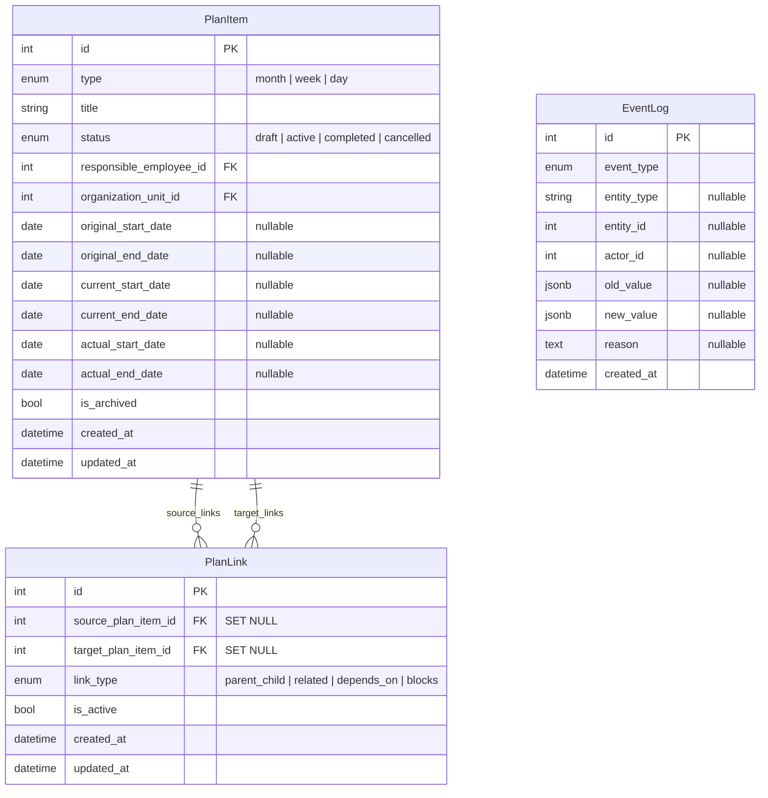

# PlanLink — Design Document

## 1. Обзор

PlanLink — отдельная модель для создания **опциональных связей** между [`PlanItem`](../../backend/app/models/plan_item.py:1) разных или одного типа.

### Назначение

- month → week (декомпозиция месяца на недели)
- week → day (декомпозиция недели на дни)
- month → day (прямая связь, без недели)
- related (связь между равнозначными планами)

### Принципы

1. **Нет жёсткой иерархии** — ни одна связь не обязательна
2. **PlanLink — отдельная сущность**, не `secondary table`
3. **Связь можно отключить** через `is_active` без удаления (soft delete)
4. **Все изменения логируются** через [`EventLog`](../../backend/app/models/event_log.py:1)
5. **EventLog хранит историю**, PlanLink не удаляется каскадно при удалении PlanItem (`ON DELETE SET NULL`)
6. **`DELETE` = soft delete** — при DELETE выставляется `is_active=false`, строка физически не удаляется

---

## 2. Enum: PlanLinkType

Добавить в [`backend/app/models/enums.py`](../../backend/app/models/enums.py:1) новый enum:

```python
class PlanLinkType(str, enum.Enum):
    PARENT_CHILD = "parent_child"
    RELATED = "related"
    DEPENDS_ON = "depends_on"   # future
    BLOCKS = "blocks"           # future
```

| Значение | Назначение | MVP |
|----------|-----------|-----|
| `parent_child` | Иерархическая связь: month→week, week→day, month→day | ✅ |
| `related` | Связь между равнозначными планами | ✅ |
| `depends_on` | Зависимость: target должен быть выполнен раньше source | ❌ |
| `blocks` | Блокировка: source блокирует target | ❌ |

### Добавить в EventType

В существующий enum [`EventType`](../../backend/app/models/enums.py:27) добавить:

```python
LINK_CREATED = "link_created"
LINK_DEACTIVATED = "link_deactivated"
LINK_ACTIVATED = "link_activated"
LINK_DELETED = "link_deleted"
```

---

## 3. Модель PlanLink

### 3.1 Поля

| Поле | Тип SQLAlchemy | Nullable | Default | Описание |
|------|---------------|----------|---------|----------|
| `id` | `Mapped[int]`, PK, autoincrement | NO | — | Первичный ключ |
| `source_plan_item_id` | `Mapped[int | None]`, FK → `plan_item.id` | YES | `NULL` | Исходный PlanItem (nullable из-за ON DELETE SET NULL) |
| `target_plan_item_id` | `Mapped[int | None]`, FK → `plan_item.id` | YES | `NULL` | Целевой PlanItem (nullable из-за ON DELETE SET NULL) |
| `link_type` | `Mapped[PlanLinkType]` | NO | `PARENT_CHILD` | Тип связи |
| `is_active` | `Mapped[bool]` | NO | `True` | Мягкое отключение связи |
| `created_at` | `Mapped[datetime]` | NO | `func.now()` | Дата создания |
| `updated_at` | `Mapped[datetime]` | NO | `func.now()`, onupdate | Дата обновления |

### 3.2 Foreign Keys

```sql
plan_link.source_plan_item_id → plan_item.id
    ON DELETE: SET NULL
    ON UPDATE: CASCADE

plan_link.target_plan_item_id → plan_item.id
    ON DELETE: SET NULL
    ON UPDATE: CASCADE
```

**Почему `SET NULL`, а не `CASCADE`:**
- Требование: «Удаление PlanItem не должно случайно удалять историю»
- При `CASCADE` удаление PlanItem удалит все PlanLink — информация о связи потеряна
- При `SET NULL` запись PlanLink остаётся, `FK` становятся `NULL`
- EventLog всё равно хранит полную историю операций над связями
- Application-level валидация гарантирует, что при создании оба FK не `NULL`
- Сами колонки `source_plan_item_id` и `target_plan_item_id` — `nullable=True` в SQLAlchemy (для соответствия схеме БД)

### 3.3 Relationships

```python
# В ПланЛинк
source_plan_item: Mapped[PlanItem | None] = relationship(
    back_populates="source_links",
    foreign_keys=[source_plan_item_id],
)
target_plan_item: Mapped[PlanItem | None] = relationship(
    back_populates="target_links",
    foreign_keys=[target_plan_item_id],
)

# В PlanItem (добавить к существующим relationships)
source_links: Mapped[list[PlanLink]] = relationship(
    back_populates="source_plan_item",
    foreign_keys=[PlanLink.source_plan_item_id],
    viewonly=True,
)
target_links: Mapped[list[PlanLink]] = relationship(
    back_populates="target_plan_item",
    foreign_keys=[PlanLink.target_plan_item_id],
    viewonly=True,
)
```

> `viewonly=True` — чтобы избежать случайных каскадных операций через ORM.
> Все операции над PlanLink — только через CRUD-слой.

### 3.4 Indexing Strategy

| Индекс | Тип | Назначение |
|--------|-----|-----------|
| `source_plan_item_id` | B-tree | Поиск исходящих связей |
| `target_plan_item_id` | B-tree | Поиск входящих связей |
| `(source_plan_item_id, target_plan_item_id, link_type)` | **UNIQUE Composite** | Защита от дублирования |
| `link_type` | B-tree | Фильтр по типу связи |
| `is_active` | Partial B-tree `WHERE is_active = true` | Активные связи |
| `(source_plan_item_id, link_type)` | Composite B-tree | Частый запрос: «исходящие связи month типа parent_child» |
| `(target_plan_item_id, link_type)` | Composite B-tree | Частый запрос: «входящие связи day типа parent_child» |

---

## 4. Validation Rules

Все правила реализуются в **сервисном слое** (CRUD/services), НЕ в модели:

### 4.1 Жёсткие правила (always enforce)

1. **No self-link**: `source_plan_item_id != target_plan_item_id`
2. **No duplicate**: уникальная комбинация `(source, target, link_type)` — через UNIQUE constraint в БД (работает только для non-NULL значений; после удаления PlanItem FK становятся NULL, что нормально)
3. **Both items must exist**: проверка при создании, что оба PlanItem есть в БД
4. **Both items must be active**: проверка, что оба PlanItem не `is_archived`
5. **Both FKs non-null при создании**: application-level валидация проверяет, что `source_plan_item_id` и `target_plan_item_id` переданы

### 4.2 Бизнес-правила (в services, могут меняться)

1. **Один parent_child тип на пару** — month может иметь parent_child с несколькими week, но два month не могут быть parent_child друг другу
2. **Циклические зависимости** — при `depends_on` проверять циклы через сервис
3. **Совместимость типов** — `parent_child` возможен только между разными уровнями (month→week, week→day, month→day)

---

## 5. Как не допустить жёсткую иерархию month/week/day

### 5.1 На уровне схемы БД

1. **Нет self-referencing FK** на [`PlanItem`](../../backend/app/models/plan_item.py:16) — таблица `plan_item` не имеет FK на саму себя
2. **PlanLink — единственный механизм связи** — любые отношения между PlanItem только через эту таблицу
3. **source / target в одной таблице** — нет отдельных колонок `month_id`, `week_id`, `day_id`
4. **SET NULL на обоих FK** — PlanItem может существовать без связей

### 5.2 На уровне модели

1. **link_type — атрибут, не иерархия** — `parent_child` всего лишь один из типов связи
2. **is_active** — связь можно отключить, не удаляя
3. **Никаких каскадных обновлений** — изменение date / status в одном PlanItem не автоматом меняет связанный

### 5.3 На уровне бизнес-логики (services)

1. Синхронизация между уровнями — **только через явные вызовы сервисов**
2. Никаких SQL-триггеров или `onupdate` каскадов
3. Сервис может предложить обновить связанные планы, но **не обязан**

---

## 6. EventLog Integration

### 6.1 События PlanLink

| EventType | Когда | Entity Type | Content |
|-----------|-------|-------------|---------|
| `LINK_CREATED` | Создание связи | `"plan_link"` | `new_value: {source_id, target_id, link_type}` |
| `LINK_DEACTIVATED` | `is_active = false` | `"plan_link"` | `old_value: {is_active: true}`, `new_value: {is_active: false}` |
| `LINK_ACTIVATED` | `is_active = true` | `"plan_link"` | `old_value: {is_active: false}`, `new_value: {is_active: true}` |
| `LINK_DELETED` | Hard delete | `"plan_link"` | `old_value: {source_id, target_id, link_type, is_active}` |

### 6.2 Формат записи в EventLog

```python
EventLog(
    event_type=EventType.LINK_CREATED,
    entity_type="plan_link",
    entity_id=<link_id>,
    actor_id=<employee_id>,  # кто создал
    new_value={
        "source_plan_item_id": 1,
        "target_plan_item_id": 5,
        "link_type": "parent_child",
    },
)
```

---

## 7. Архитектурная схема



---

## 8. API Endpoints для MVP

### 8.1 Endpoints

| Метод | Path | Описание |
|-------|------|----------|
| `POST` | `/plan-links/` | Создать связь |
| `GET` | `/plan-links/` | Список связей (с фильтрами) |
| `GET` | `/plan-links/{id}` | Получить связь по ID |
| `PATCH` | `/plan-links/{id}` | Обновить связь (link_type, is_active) |
| `DELETE` | `/plan-links/{id}` | Удалить связь **(soft delete:** `is_active=false` + EventLog `LINK_DEACTIVATED`) |
| `GET` | `/plan-items/{id}/links` | Все связи PlanItem (source + target) |

### 8.2 Фильтры для `GET /plan-links/`

- `source_plan_item_id` — фильтр по source
- `target_plan_item_id` — фильтр по target
- `link_type` — фильтр по типу связи
- `is_active` — фильтр по активности
- `skip`, `limit` — пагинация

### 8.3 Форматы запросов/ответов

**POST /plan-links/**
```json
{
    "source_plan_item_id": 1,
    "target_plan_item_id": 5,
    "link_type": "parent_child",
    "actor_id": 42
}
```

**Response**
```json
{
    "id": 10,
    "source_plan_item_id": 1,
    "target_plan_item_id": 5,
    "link_type": "parent_child",
    "is_active": true,
    "created_at": "2026-05-08T10:00:00Z",
    "updated_at": "2026-05-08T10:00:00Z"
}
```

**GET /plan-items/{id}/links**
```json
{
    "plan_item_id": 1,
    "outgoing_links": [
        {
            "id": 10,
            "target_plan_item_id": 5,
            "link_type": "parent_child",
            "is_active": true
        }
    ],
    "incoming_links": [
        {
            "id": 7,
            "source_plan_item_id": 3,
            "link_type": "related",
            "is_active": true
        }
    ]
}
```

---

## 9. Рекомендуемая структура файлов

```
backend/app/
  models/
    enums.py              # + PlanLinkType, + EventType.LINK_*
    plan_item.py          # + source_links, target_links relationships
    plan_link.py          # NEW — модель PlanLink
  schemas/
    plan_link.py          # NEW — Pydantic схемы
  crud/
    plan_link.py          # NEW — CRUD + EventLog
  api/
    plan_link.py          # NEW — роутер
    plan_items.py         # + GET /{id}/links
  main.py                 # + register plan_link router
```

---

## 10. План реализации для Code mode

### Шаг 1: Обновить enums.py
- Добавить `PlanLinkType` enum
- Добавить `LINK_CREATED`, `LINK_DEACTIVATED`, `LINK_ACTIVATED`, `LINK_DELETED` в `EventType`

### Шаг 2: Создать model plan_link.py
- Модель с полями из секции 3
- FK `source_plan_item_id` → `plan_item.id` ON DELETE SET NULL
- FK `target_plan_item_id` → `plan_item.id` ON DELETE SET NULL
- UNIQUE constraint: `(source_plan_item_id, target_plan_item_id, link_type)`
- Индексы из секции 3.4

### Шаг 3: Обновить model plan_item.py
- Добавить `source_links` и `target_links` relationships (viewonly=True)

### Шаг 4: Обновить models/__init__.py
- Импортировать `PlanLink`

### Шаг 5: Создать schemas/plan_link.py
- `PlanLinkBase` — source_plan_item_id, target_plan_item_id, link_type
- `PlanLinkCreate` — наследует Base + actor_id
- `PlanLinkUpdate` — link_type, is_active (опционально)
- `PlanLinkRead` — все поля
- `PlanItemLinksRead` — входящие/исходящие связи для PlanItem

### Шаг 6: Создать crud/plan_link.py
- `create` — создать связь + EventLog LINK_CREATED
- `get_by_id` — получить по ID
- `get_multi` — список с фильтрами
- `update` — обновить (link_type) + EventLog при необходимости
- `soft_delete` — выставить `is_active=false` + EventLog LINK_DEACTIVATED (это и есть `DELETE`)
- `activate` — выставить `is_active=true` + EventLog LINK_ACTIVATED (опционально)
- `get_plan_item_links` — все связи PlanItem

### Шаг 7: Создать api/plan_link.py
- Роутер `/plan-links/`
- CRUD endpoints
- `DELETE /plan-links/{id}` — **soft delete** (is_active=false), не hard delete
- Валидация: source != target, оба PlanItem существуют

### Шаг 8: Обновить api/plan_items.py
- Endpoint `GET /plan-items/{id}/links`

### Шаг 9: Обновить main.py
- Зарегистрировать `plan_link` router

### Шаг 10: Создать Alembic migration
```bash
cd /mnt/g/Code/galera-planner/backend
source .venv/bin/activate
python -m alembic revision --autogenerate -m "Add PlanLink model"
```

### Шаг 11: Проверить миграцию
- `plan_link_type` enum (только `parent_child`, `related` для MVP; `depends_on`, `blocks` в коде определены, но в БД пока не добавлять — или добавить все значения сразу для будущей совместимости — решение на этапе реализации)
- `event_type` enum — проверка добавления `LINK_*` значений
- Таблица `plan_link` с FK (nullable, ON DELETE SET NULL), индексами
- Downgrade — корректное удаление

---

## 11. Ключевые решения и их обоснование

| Решение | Альтернатива | Выбрано | Почему |
|---------|-------------|---------|--------|
| `SET NULL` on delete | `CASCADE` | `SET NULL` | Сохраняет записи PlanLink при удалении PlanItem |
| `viewonly=True` у relationships | Обычный relationship | `viewonly=True` | Предотвращает случайные каскадные операции через ORM |
| Unique `(source, target, link_type)` | Unique `(source, target)` | С link_type | Позволяет иметь parent_child и related между теми же двумя PlanItem |
| Отдельный enum PlanLinkType | String-поле | Enum | Строгая типизация, поддержка БД |
| is_active в PlanLink | DELETE при отключении | is_active | Мягкое удаление, возможность восстановления |
